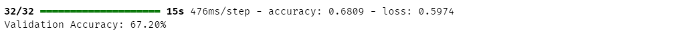

### Apa itu TensorFlow?

TensorFlow adalah framework open-source yang dikembangkan oleh Google untuk mendukung kebutuhan machine learning dan deep learning. Framework ini sangat fleksibel, mendukung berbagai jenis arsitektur model, dan dapat digunakan untuk tugas-tugas seperti klasifikasi, prediksi, hingga pengenalan gambar dan suara. TensorFlow sering digunakan dalam implementasi Computer Vision karena memiliki alat yang efisien untuk memproses data visual dan membangun model berbasis AI secara scalable


### Apa itu Computer Vision?

Computer Vision (CV) adalah cabang dari kecerdasan buatan (AI) yang memungkinkan komputer untuk memahami dan menafsirkan dunia visual. Teknologi ini memungkinkan mesin untuk menganalisis, mengenali, dan mengekstrak informasi dari gambar atau video dengan cara yang mirip dengan kemampuan manusia.

### Aplikasi Computer Vision

Beberapa aplikasi Computer Vision yang populer meliputi:

1. Pengenalan Wajah Digunakan dalam keamanan biometrik seperti sistem penguncian wajah di smartphone.
2. Deteksi Objek Memungkinkan deteksi objek dalam gambar atau video, seperti kendaraan dalam sistem pengawasan lalu lintas.
3. Klasifikasi Gambar Mengklasifikasikan gambar ke dalam kategori tertentu, seperti identifikasi jenis hewan dalam foto.
4. Peningkatan Resolusi Gambar Memperbaiki kualitas gambar, seperti mengubah resolusi gambar rendah menjadi tinggi.
5. Pemrosesan Video Menganalisis video untuk mendeteksi pola atau pergerakan, misalnya dalam olahraga.

### Tantangan dalam Computer Vision

Meskipun sangat menjanjikan, Computer Vision menghadapi beberapa tantangan:

1. Variasi Data Gambar dapat memiliki berbagai variasi dalam pencahayaan, posisi, atau orientasi.
2. Kompleksitas Komputasi Model CV sering membutuhkan sumber daya komputasi yang tinggi.
3. Kekurangan Data Model memerlukan dataset besar dan berkualitas tinggi untuk performa yang optimal.
4. Bias dalam Data Dataset yang tidak seimbang dapat menyebabkan hasil yang bias.

### Implementasi Computer Vision dengan TensorFlow

TensorFlow adalah salah satu framework populer untuk membangun model Computer Vision. Berikut adalah contoh implementasi sederhana untuk klasifikasi gambar:

#### Langkah 1: Persiapan Dataset

Gunakan dataset dari TensorFlow Datasets atau dataset lokal Anda. Misalnya, kita akan menggunakan dataset Cats vs Dogs:

Download: https://storage.googleapis.com/mledu-datasets/cats_and_dogs_filtered.zip


#### Langkah 2: Preprocessing Dataset

Preprocessing adalah langkah penting untuk memastikan gambar memiliki format yang seragam sebelum masuk ke model:

```python

import os
import tensorflow as tf
from tensorflow.keras.preprocessing.image import ImageDataGenerator

base_dir = 'data/cats_and_dogs_filtered/'
train_dir = os.path.join(base_dir, 'train')
validation_dir = os.path.join(base_dir, 'validation')

train_datagen = ImageDataGenerator(rescale=1./255,
                                   rotation_range=40,
                                   width_shift_range=0.2,
                                   height_shift_range=0.2,
                                   shear_range=0.2,
                                   zoom_range=0.2,
                                   horizontal_flip=True)

validation_generator = train_datagen.flow_from_directory(validation_dir, target_size=(150, 150), batch_size=32, class_mode='binary')
train_generator = train_datagen.flow_from_directory(train_dir, target_size=(150, 150), batch_size=32, class_mode='binary')

```


#### Langkah 3: Membuat Model CNN

Convolutional Neural Network (CNN) adalah arsitektur yang umum digunakan dalam Computer Vision:

```python
model = tf.keras.models.Sequential([
    tf.keras.layers.Conv2D(32, (3, 3), activation='relu', input_shape=(150, 150, 3)),
    tf.keras.layers.MaxPooling2D(2, 2),
    tf.keras.layers.Conv2D(64, (3, 3), activation='relu'),
    tf.keras.layers.MaxPooling2D(2, 2),
    tf.keras.layers.Conv2D(128, (3, 3), activation='relu'),
    tf.keras.layers.MaxPooling2D(2, 2),
    tf.keras.layers.Flatten(),
    tf.keras.layers.Dense(512, activation='relu'),
    tf.keras.layers.Dense(1, activation='sigmoid')
])
```

#### Langkah 4: Melatih Model

Latih model dengan data yang sudah diproses:

```python
model.compile(optimizer='adam',
              loss='binary_crossentropy',
              metrics=['accuracy'])

history = model.fit(train_generator,
                    steps_per_epoch=100,
                    epochs=15,
                    validation_data=validation_generator,
                    validation_steps=len(validation_generator) // 32)
```

Hasil pelatihan model menunjukkan bahwa akurasi pada data training meningkat secara bertahap dari 51.41% di Epoch 1 menjadi 70.59% di Epoch 15, dengan penurunan loss dari 0.9107 menjadi 0.5583. Ini menunjukkan bahwa model belajar dengan baik pada data training.

Namun, pada data validasi, akurasi tidak selalu meningkat secara konsisten. Validation accuracy berkisar antara 53.12% hingga 71.88%, sedangkan validation loss awalnya menurun dari 0.6900 menjadi 0.5898, tetapi mulai meningkat lagi di beberapa epoch terakhir, seperti 0.7401 pada Epoch 15. Hal ini mengindikasikan potensi overfitting, di mana model terlalu fokus pada data training sehingga kehilangan kemampuan generalisasi terhadap data validasi

#### Langkah 5: Evaluasi Model

Setelah pelatihan selesai, evaluasi model menggunakan data validasi:

```python
eval_result = model.evaluate(validation_generator)
print(f"Validation Accuracy: {eval_result[1]*100:.2f}%")
```


```python
import matplotlib.pyplot as plt
import matplotlib.image as mpimg

plt.plot(history.history['accuracy'],c='k',lw=2)
plt.grid(True)
plt.title("Training accuracy with epochs\n",fontsize=18)
plt.xlabel("Training epochs",fontsize=15)
plt.ylabel("Training accuracy",fontsize=15)
plt.show()
```


### Langkah 6: Prediksi Gambar

Gunakan model untuk memprediksi gambar 

```python
from keras.preprocessing import image
import numpy as np
import matplotlib.pyplot as plt

test_path = os.path.join(validation_dir, 'cats')  # Contoh folder
test_images = os.listdir(test_path)

# Prediksi gambar
for img_name in test_images[:5]:  # Batasi ke 5 gambar
    img_path = os.path.join(test_path, img_name)
    img = image.load_img(img_path, target_size=(150, 150))
    img_array = image.img_to_array(img) / 255.0
    img_array = np.expand_dims(img_array, axis=0)
    prediction = model.predict(img_array)
    
    plt.imshow(img)
    plt.axis('off')
    plt.show()
    if prediction[0] > 0.5:
        print(f"{img_name}: Gambar menunjukkan **Anjing** dengan probabilitas {prediction[0][0]:.2f}")
    else:
        print(f"{img_name}: Gambar menunjukkan **Kucing** dengan probabilitas {1 - prediction[0][0]:.2f}")
```


### Kesimpulan

Dengan menggunakan TensorFlow, kita dapat membangun model Computer Vision yang efektif untuk berbagai aplikasi. Framework ini memberikan fleksibilitas tinggi untuk menangani tantangan seperti variasi data dan kebutuhan komputasi tinggi. Dengan pipeline yang jelas, mulai dari preprocessing hingga evaluasi, proses pengembangan model menjadi lebih terstruktur dan efisien..
